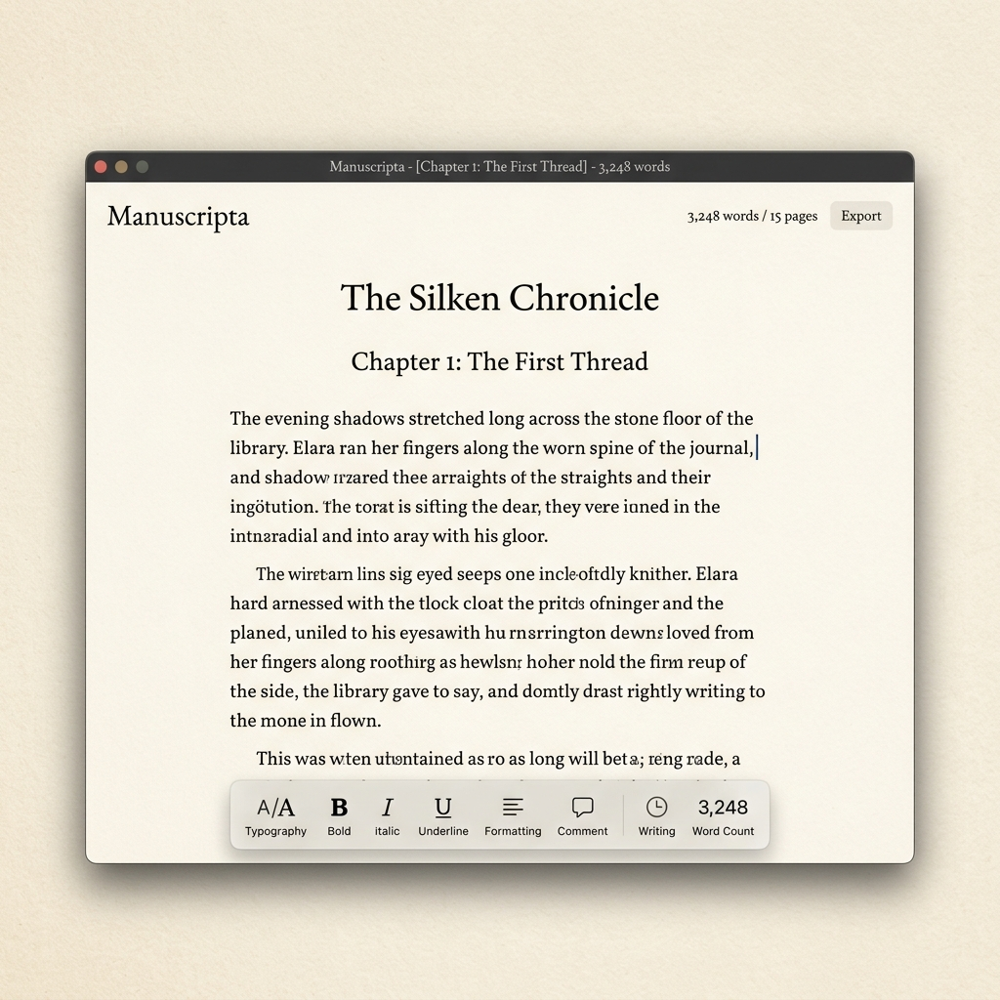

# 🖋️ Manuscripta

A premium, highly-aesthetic web-based writing environment designed for authors, screenwriters, and world-builders. Manuscripta combines distraction-free writing with powerful visualization tools, wrapping complex narrative architecture in a clean, native-feeling UI inspired by best-in-class apps like Bear, Linear, and Craft.

**[Live Demo on Vercel](https://writingapp-aayush.vercel.app)**

## 📸 Gallery

<p align="center">
  
  
</p>

## ✨ Core Features

*   **Typewriter Mode**: A distraction-free, Tiptap-powered rich text editor with interactive floating toolbars, focus modes, and intelligent text highlighting.
*   **Neural Net**: A dynamic, drag-and-drop node graph (powered by React Flow) to map out character relationships, lore, and interconnected story elements. Features custom physics-like draggable wires and interactive waypoints.
*   **The Lookbook**: A visually stunning grid to store inspiration, mood boards, and visual references. Features smooth gradient text-fading and micro-animations.
*   **The Timeline**: A chronological beat-board to track story progression, plot points, and pacing.
*   **Blueprint & Sandbox**: Advanced outlining and freeform scratchpad modules.
*   **Ambient Player**: Built-in Spotify integration and ambient soundscapes to keep you in the flow state.
*   **Bookshelf Interface**: A beautifully animated, physical-feeling library to manage all your active projects and manuscripts.

## 🎨 Premium Aesthetics

Manuscripta is built with a focus on "luxurious" web design:
*   **Glassmorphism & Blurs**: Deep `backdrop-blur-2xl` effects on dropdowns and floating menus.
*   **Native-Feeling Interactions**: Custom spring-animations, tactile `active:scale` press states, and `cursor-default` overrides to mimic native desktop applications.
*   **Warm Light Mode**: Curated off-white and parchment tones to reduce eye strain during long writing sessions.
*   **Typography**: Clean, highly readable typography optimized for both UI navigation and long-form prose.

## 🛠️ Tech Stack

*   **Framework**: [Next.js 16](https://nextjs.org/) (App Router, Turbopack)
*   **State Management**: [Zustand](https://github.com/pmndrs/zustand)
*   **Editor**: [Tiptap](https://tiptap.dev/)
*   **Graph/Nodes**: [React Flow](https://reactflow.dev/)
*   **Animations**: [Framer Motion](https://www.framer.com/motion/)
*   **Styling**: [Tailwind CSS](https://tailwindcss.com/)

## 🚀 Getting Started

First, clone the repository and install dependencies:

```bash
git clone https://github.com/aayushmotwani-dev/writing-app.git
cd writing-app
npm install
```

Then, run the development server:

```bash
npm run dev
```

Open [http://localhost:3000](http://localhost:3000) with your browser to see the result. The application stores state locally to ensure a snappy, private writing experience.
